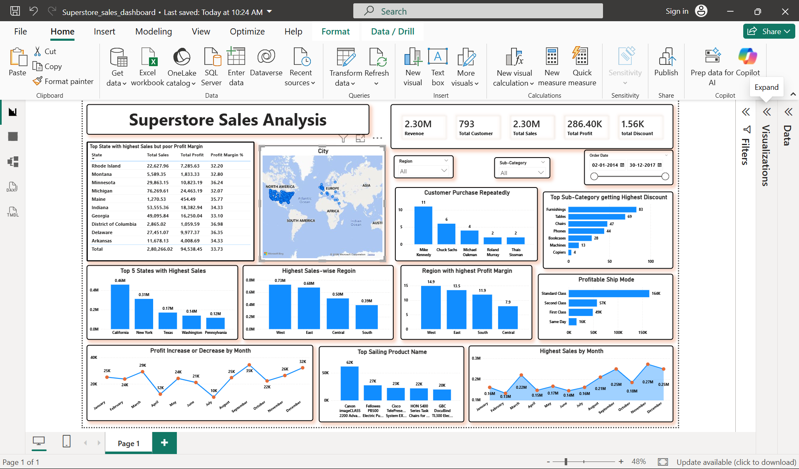

# Superstore Sales Analysis
This project analyzes a superstore sales dataset to discove Sales trends, Repeated Customer and profitability patterns. Using SQL-based Analysis, Python cleaning, Power-BI Visual Dashboard.

## Table of contents
- [Superstore Sales Analysis](#superstore-sales-analysis)
  - [Table of contents](#table-of-contents)
  - [Overview](#overview)
  - [Business Problem](#business-problem)
  - [Dataset](#dataset)
  - [Tools \& Techonologies](#tools--techonologies)
  - [Project Workflow](#project-workflow)
  - [Project Structure](#project-structure)
  - [SQL Data Analysis](#sql-data-analysis)
  - [Dashboard](#dashboard)
  - [Key Insights](#key-insights)
  - [Recommendation](#recommendation)
  - [Contact](#contact)

  
## Overview
  - This project analysis a real-world dataset to analise sales and profit trends across regions and categories.
  - Identify top-performing products and customer segments.  
  - Evaluate the impact of discounts on profitability.
  - Create interactive dashboards for business insights.
  - upport data-driven decision making using analytical reporting.
## Business Problem
  - It is unclear which product categories contribute the most to revenue and profit.
 - High discounts may negatively impact profitability.
 - Revenue performance is fragmented across time, making it difficult to identify seasonality and growth trends.
 - Customer purchasing patterns and repeat purchase behavior are not clearly analyzed.

## Dataset 
  The dataset Superstore sales transaction records including:
  -  Order Details
  -  Customer Information
  -  Product categories
  -  Sales
  -  Profit
  -  Discount
  -  Shipping Information
  -  Regions Information

## Tools & Techonologies
### Python
- Pandas 
- Data cleaning 
- Handling Null and Duplicate values

### SQL(PostgreSQL)
- Data Extraction
- Data Analysis
- Business insights Generation


### Power BI
- Intractive Dashboard
- DAX measures 
- KPI Visualization
- Sales Trend Analysis
- Profit Margin Analysis

## Project Workflow

1. Data Import & Cleaning using Python
    - Imported CSV dataset into Python
    - Performed data cleaning and preprocessing
    - Checked missing values and duplicate records
    - Converted data types where required

2. Data Import into PostgresSql 
   - Imported cleaned dataset into PostgreSQL
   - Performed SQL-based Data Analysis

3. Performed Sales Analysis using SQL:

    - Highest Discount sub-catogries

    - Profit and Sales trends

    - Most Profitable Segment

    - Repeat Customer Analysis
  
    - Region with highest Sales

    - Region with highest Profit Margin

4. Exported cleaned data to Power BI
   
   - Total Sales KPI

   - Total Profit KPI

   - Profit Margin Analysis

   - Month-wise Sales Trend

   - Regional Sales Analysis

5. Dashboard Design
    -  Designed a dynamic & user-friendly dashboard with interactive filters and visuals

6. Business insights & Recommendations
    - Generated actionable insights to support business decision-making

## Project Structure

```
Superstore-Sales-Analysis/
├── data/                        # Raw and cleaned dataset
│   ├── Superstore.csv
│   
├── notebooks/            # Data cleaning notebooks
│   ├── conn.ipynb
│  
├── sql_files/                 # SQL scripts
│   ├── SQL_Analysis.sql
├── dashboard/
│   └── Superstore_sales_dashboard.pbix
├── images/
│   └── e-commerce-dashboard1.png
├── README.md
└── requirements.txt
```

## SQL Data Analysis

### Order Analysis

  - Total Orders: 9,994
  - Highest Orders by Customer: 17
  - Top State by Sales: California
  - Maximum Discount Observed: 80%
  - Most Profitable Category: Technology
  - Highest Sales Sub-Category: Phones

### Revenue Analysis

  - Total Revenue: 2.29M
  - Total Profit: 286K
  - Highest Revenue-Generating Category: Technology
  - Top 5 Sub-Categories by Revenue:
      1.  Phones
      2. Chairs
      3. Storage
      4. Tables
      5. Binders
   
### Product Analysis
  - Total Products Sold: 38K
  - Highest Selling Category: Office Supplies
  - Highest Profit Margin Category: Technology
  - Lowest Profit Margin Category: Furniture
  
## Dashboard 

 
- Month-wise Sales Trends
- Category-wise Revenue Analysis
- Category-wise Revenue Analysis
- Discount Analysis
- Regional Profit Analysis
- Customer Segment Analysis
- KPI Cards for Sales, Profit, and Profit Margin
   
## Key Insights
 1. Sales Performance
      - Total Revenue generated was 2.29M with a total profit of 286K.
  
      - Sales reached their peak during the fourth quarter (Q4), especially in November and December, showing strong seasonal demand.
 
      - Furniture category contributed high sales but showed lower profitability due to heavy discounts 82.80.
    
 2. Customer Analysis
     - The Consumer segment contributed the highest number of orders and overall sales 1161401.35.

     - Corporate customers generated higher average order values compared to other customer segments.

     - A small percentage of customers generated repeat purchases 788 consistently, indicating opportunities for improving customer retention.

  3. Discount Analysis
   
     - Discounts above 20%–30% negatively impacted profitability in many orders.

      - Several high-discount orders resulted in very low or negative profit margins.

       - Sub-categories receiving the highest discounts were not always the highest profit contributors.
  
  4. Product Analysis

      - Phones were the top-performing sub-category by sales revenue.

      - Office Supplies recorded the highest quantity of products sold.

      - Technology products maintained higher profit margins compared to Furniture and Office Supplies.

## Recommendation

  - Reduce excessive discounts on low-profit sub-categories.
  
  - Focus marketing efforts on high-performing categories like Technology.
  
  - Improve customer retention strategies to increase repeat purchases.

  - Monitor regional pricing and discount strategies to improve profitability.

  - Optimize inventory planning based on seasonal sales trends.
  
## Contact
- **Name**: Rafia
- **LinkedIn**: (www.linkedin.com/in/rafiakhan3023)
- **Email**: (rafiaqureshi2302@gmail.com)
